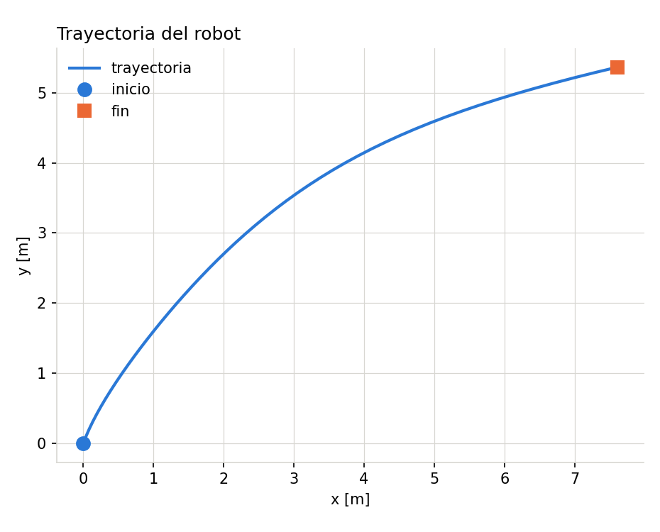
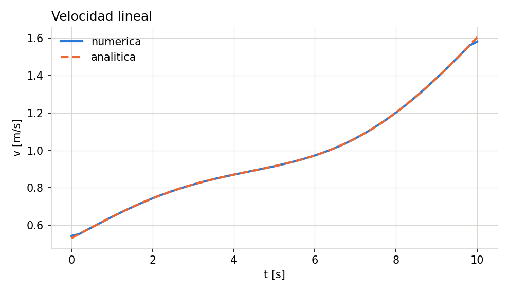
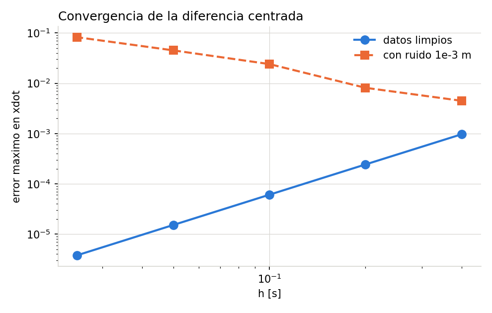

## 1. Procedimiento y notación

La cadena de cálculo es la misma en los tres entornos:

$$(x, y, t) \;\longrightarrow\; (\dot{x}, \dot{y}) \;\longrightarrow\; (v, \theta) \;\longrightarrow\; \omega$$

con

$$v = \sqrt{\dot{x}^2 + \dot{y}^2}, \qquad \theta = \operatorname{atan2}(\dot{y}, \dot{x}), \qquad \omega = \dot{\theta}$$

Hay **dos diferenciaciones encadenadas**: una para pasar de posición a velocidad y otra para pasar de orientación a velocidad angular. Esa estructura explica casi todo lo que se observa después.

### Esquemas utilizados

| Esquema | Fórmula | Orden |
|:---|:---|:---:|
| Hacia adelante | $(f_{i+1}-f_i)/h$ | $O(h)$ |
| Hacia atrás | $(f_i-f_{i-1})/h$ | $O(h)$ |
| Centrada | $(f_{i+1}-f_{i-1})/(2h)$ | $O(h^2)$ |

En el interior se usa siempre la diferencia centrada. En los extremos, Octave y C++ emplean fórmulas unilaterales **de tres puntos**, también $O(h^2)$:

$$f'(t_0) \approx \frac{-3f_0 + 4f_1 - f_2}{2h}, \qquad f'(t_{n-1}) \approx \frac{3f_{n-1} - 4f_{n-2} + f_{n-3}}{2h}$$

La razón de no usar las de dos puntos se desarrolla en la sección 6.2.

---

## 2. Datos del robot

51 muestras equiespaciadas, $t_i = 0.2\,i$ con $i = 0,\dots,50$:

$$x(t) = 0.08\,t^2 + 0.40\sin(0.45\,t), \qquad y(t) = 0.50\,t + 0.30\left(1 - \cos(0.45\,t)\right)$$

| Magnitud | Rango |
|:---|:---|
| $t$ | 0 a 10 s, $h$ = 0.2 s |
| $x$ | 0 a 7.6090 m |
| $y$ | 0 a 5.3632 m |

Como la trayectoria es analítica, se derivó a mano para disponer de una **referencia exacta** contra la cual medir el error de cada método:

$$\dot{x} = 0.16t + 0.18\cos(0.45t), \qquad \dot{y} = 0.50 + 0.135\sin(0.45t)$$

$$\ddot{x} = 0.16 - 0.081\sin(0.45t), \qquad \ddot{y} = 0.06075\cos(0.45t)$$

y la velocidad angular exacta, obtenida al derivar $\operatorname{atan2}(\dot y, \dot x)$:

$$\omega_{\text{exacta}} = \frac{\dot{x}\,\ddot{y} - \dot{y}\,\ddot{x}}{\dot{x}^2 + \dot{y}^2}$$

Esto permite reportar errores absolutos reales y no solo discrepancias entre implementaciones.

---

## 3. Resultados

Los valores obtenidos, idénticos en los tres entornos salvo en los extremos:

| Magnitud | Rango calculado |
|:---|:---|
| $v$ | 0.5316 a 1.6046 m/s |
| $\theta$ | 0.2312 a 1.2244 rad |
| $\omega$ | −0.2339 a −0.0441 rad/s |

La velocidad angular es negativa en todo el recorrido: el robot gira de forma sostenida en el mismo sentido, coherente con una trayectoria que se curva hacia la derecha.

### 3.1 Error frente a la solución analítica

| Magnitud | Error interior | Error global |
|:---|---:|---:|
| $\dot{x}$ | 2.429×10⁻⁴ | 4.846×10⁻⁴ |
| $v$ | 2.344×10⁻⁴ | 2.344×10⁻⁴ |
| $\theta$ | 3.925×10⁻⁴ | 8.421×10⁻⁴ |
| $\omega$ | 2.317×10⁻³ | 1.071×10⁻² |

El error de $\omega$ es un orden de magnitud mayor que el de $v$. No es casualidad y se analiza en la sección 6.2.

### 3.2 Comparación de esquemas

Error máximo en $\dot{x}$ con $h$ = 0.2 s:

| Esquema | Error máximo | Relación |
|:---|---:|---:|
| Hacia adelante | 2.380×10⁻² | 98× |
| Hacia atrás | 2.386×10⁻² | 98× |
| **Centrada** | **2.429×10⁻⁴** | 1× |

Casi cien veces mejor con el mismo número de datos y el mismo costo computacional. La diferencia centrada no requiere más operaciones que las unilaterales: la ganancia proviene de la cancelación del término de primer orden en la serie de Taylor.

### 3.3 Verificación del orden $O(h^2)$

| $h$ [s] | Error máximo en $\dot{x}$ | Razón |
|---:|---:|---:|
| 0.400 | 9.672×10⁻⁴ | — |
| 0.200 | 2.429×10⁻⁴ | 3.98 |
| 0.100 | 6.074×10⁻⁵ | 4.00 |
| 0.050 | 1.519×10⁻⁵ | 4.00 |
| 0.025 | 3.797×10⁻⁶ | 4.00 |

Al dividir $h$ entre dos el error se divide entre cuatro. La razón converge a 4.00 con tres cifras, que es la confirmación numérica del orden cuadrático.

---

### 3.4 Gráficas

{width=72%}

{width=92%}

{width=92%}

{width=92%}

\clearpage

## 4. Implementaciones

### 4.1 Parte 1 — GNU Octave

Carga con `csvread`, diferencias centradas vectorizadas sobre el interior y fórmulas de tres puntos en los extremos:

```octave
d(2:n-1) = (f(3:n) - f(1:n-2)) / (2*h);         % interior, vectorizado
d(1)     = (-3*f(1) + 4*f(2) - f(3)) / (2*h);   % adelante, 3 puntos
d(n)     = ( 3*f(n) - 4*f(n-1) + f(n-2)) / (2*h);
```

El desenvolvimiento angular usa la función `unwrap` incorporada. Se generan las cuatro gráficas pedidas: $y$ vs $x$, $v$ vs $t$, $\theta$ vs $t$ y $\omega$ vs $t$.

### 4.2 Parte 2 — Python con NumPy

```python
vx = np.gradient(x, t)
vy = np.gradient(y, t)
v  = np.sqrt(vx**2 + vy**2)
theta = np.unwrap(np.arctan2(vy, vx))
omega = np.gradient(theta, t)
```

**Qué operación reemplaza las diferencias explícitas.** `np.gradient` sustituye por completo el bucle: aplica diferencias centradas en el interior en una sola llamada vectorizada, y acepta el vector de tiempos como segundo argumento, de modo que funciona también con muestreo no uniforme.

**Cómo trata los extremos.** Aquí está la diferencia importante con las otras dos implementaciones: `np.gradient` usa fórmulas unilaterales **de dos puntos**, de orden $O(h)$. Por eso sus valores en $i=0$ e $i=n-1$ son menos exactos. Se puede pedir el comportamiento de segundo orden con `edge_order=2`.

### 4.3 Parte 3 — C/C++ con GSL

Lectura manual del CSV, diferencias centradas sobre los arreglos, y desenvolvimiento angular implementado explícitamente acumulando múltiplos de $2\pi$:

```cpp
for (size_t i = 1; i < th.size(); ++i) {
    double d = th[i] - th[i-1];
    if (d >  M_PI) correccion -= 2.0*M_PI;
    if (d < -M_PI) correccion += 2.0*M_PI;
    u[i] = th[i] + correccion;
}
```

**Exploración de `gsl_deriv_central`.** La rutina se aplicó a $x(t)$ como función evaluable, para contrastarla con la diferencia sobre datos tabulados:

| $t$ [s] | `gsl_deriv_central` | Error GSL | Error tabulado |
|---:|---:|---:|---:|
| 2.0 | 4.318898×10⁻¹ | 7.135×10⁻¹² | 1.510×10⁻⁴ |
| 4.0 | 5.991036×10⁻¹ | 3.015×10⁻¹¹ | 5.519×10⁻⁵ |
| 6.0 | 7.972670×10⁻¹ | 4.432×10⁻¹¹ | 2.196×10⁻⁴ |
| 8.0 | 1.118583×10⁰ | 2.184×10⁻¹¹ | 2.178×10⁻⁴ |

**Por qué los datos tabulados exigen otra estrategia.** Siete órdenes de magnitud separan los dos errores, y la causa no es que un algoritmo sea mejor que el otro: es que resuelven problemas distintos.

`gsl_deriv_central` recibe un puntero a función, así que puede **evaluar $f$ en cualquier punto**. Eso le permite escoger su propio paso, refinarlo, usar extrapolación de Richardson y hasta devolver una estimación del error.

Con 51 muestras fijas no existe $f(t)$ fuera de la malla. El paso lo impone el muestreo y no se puede reducir: la única información disponible son esos 51 pares. Por eso las diferencias se aplican directamente sobre los arreglos, y GSL queda disponible para otras operaciones numéricas del programa.

Es la distinción didáctica central del taller: **diferenciar una función no es lo mismo que diferenciar una colección de datos muestreados**.

---

## 5. Comparación de resultados

| Criterio | Octave | Python | C/C++ + GSL |
|:---|:---|:---|:---|
| Carga de datos | `csvread`, una línea | `np.loadtxt`, una línea | ~20 líneas con `ifstream` y `stringstream` |
| Cálculo de $\dot x,\dot y$ | Rebanadas vectorizadas | `np.gradient(x, t)` | Bucle explícito sobre el arreglo |
| Cálculo de $v$ | `sqrt(xdot.^2+ydot.^2)` | `np.hypot(vx, vy)` | Bucle con `std::sqrt` |
| Cálculo de $\theta$ | `unwrap(atan2(...))` | `np.unwrap(np.arctan2(...))` | `std::atan2` + unwrap propio |
| Cálculo de $\omega$ | Misma función de derivada | `np.gradient(theta, t)` | Misma función de derivada |
| Manejo de arreglos | Nativo, indexado desde 1 | Nativo, vistas sin copia | `std::vector`, gestión manual |
| Facilidad de implementación | Alta | Alta | Baja: I/O y unwrap a mano |
| Control sobre el algoritmo | Medio | Bajo con `gradient`; alto si se escribe a mano | Total: cada operación es explícita |
| Tiempo de ejecución | 1.47 s | 1.28 s | **0.003 s** |

Sobre la última fila: los tiempos de Octave y Python corresponden al programa completo, que incluye el arranque del intérprete, la generación de gráficas y un estudio de ruido por Monte Carlo. El núcleo de cálculo en Python son 97 µs. La comparación justa no es 1.28 s contra 0.003 s, pero el orden de magnitud a favor de C++ se mantiene en cualquier medición.

### 5.1 Coincidencia entre entornos

| Columna | Octave vs C++ | Octave vs Python | Python vs C++ |
|:---|---:|---:|---:|
| $\dot x$ | **0.00** | 2.37×10⁻² | 2.37×10⁻² |
| $v$ | **0.00** | 2.27×10⁻² | 2.27×10⁻² |
| $\theta$ | **0.00** | 2.27×10⁻² | 2.27×10⁻² |
| $\omega$ | **0.00** | 1.25×10⁻¹ | 1.25×10⁻¹ |

Octave y C++ coinciden **bit a bit**, porque implementan exactamente las mismas fórmulas, incluidas las de los extremos. Python difiere, pero solo en los bordes: restringido al interior, $v$ coincide también con cero absoluto en los tres entornos.

La discrepancia no mide calidad de implementación sino una decisión de diseño distinta en `np.gradient`.

---